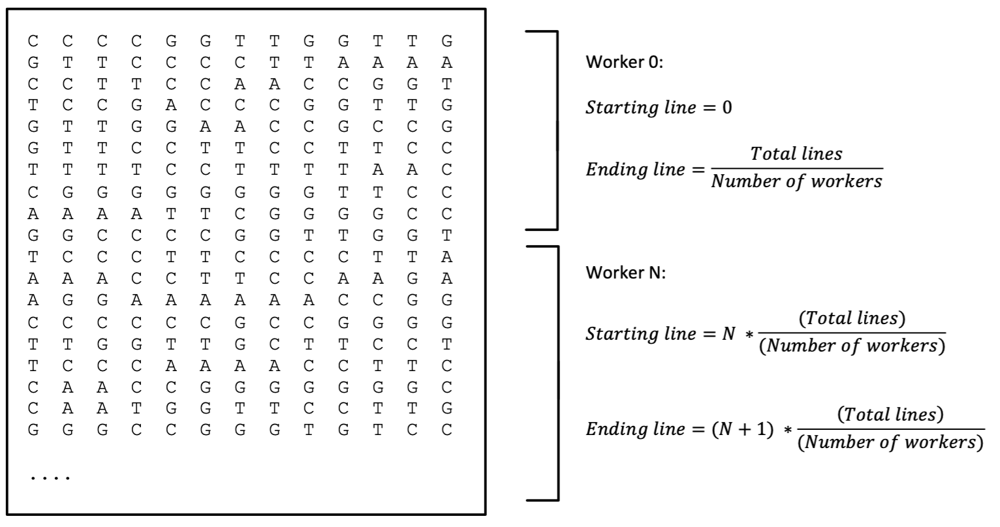
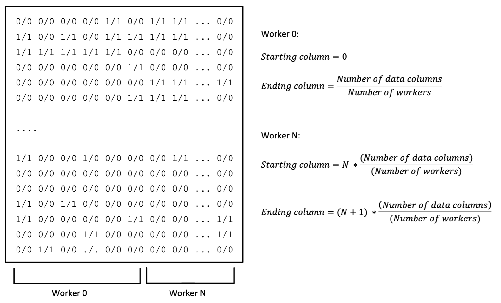
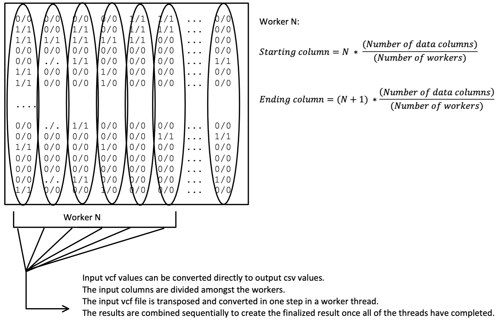
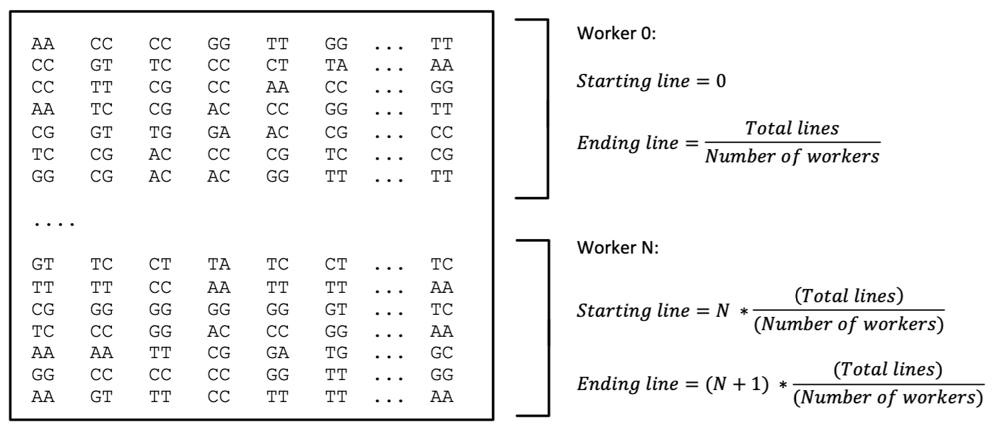
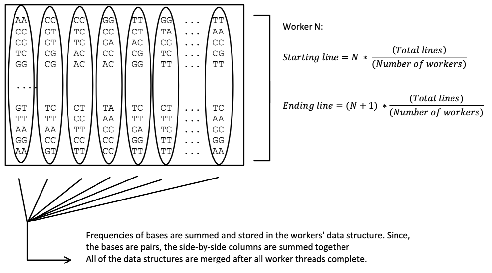
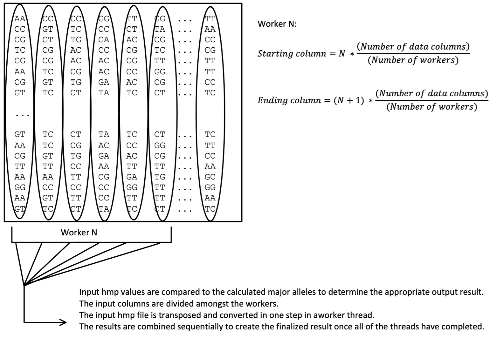

# snpTools
# Converter - Read Me
The purpose of this program is to allow the conversion of biological Single Nucleotide Polymorphisms (SNPs) data between common data formats. Formats include plink (.ped, .map) to csv, vcf to csv, and hapmap (.hmp) to csv. Conversion between .vcf and .hmp is also available.

SNPs are records of changes in single DNA base pairs and are often stored in a variety of file formats depending on the source and configuration settings. Conversion between formats is necessary to take advantage of the many analysis tools available today that only support certain data formats.

Conversion currently only supports diploid cells.
The main entry point is DataInput.java, it creates and starts the conversion process according to the mode argument.

The general flow of conversion works as follows:
* determine file layout and constraints
* normalize data by dividing and distributing work
* collect results
* calculate intermediate data
* analyze input with intermediate data
* generate results
* merge results
* cleanup temporary files

<b>Always check the terminal for warnings before using results.</b>

Always make sure the output is a rectangular matrix. You may need to use a variety of unix commands to verify this on large files.

***
# Requirements:

* macOS or Unix

* Quad-core CPU, 8gb RAM minimum, ssd

* 3-4 times the input file's size in free disk available

* Java 16.0.2

* Maven 3.8.2

* JUnit 5 (5.7.2)

***
# Compilation and running:
A simple maven build+test and run script is provided for convenience as well as basic build and run scripts.
The maven script assumes you have mvn properly installed and both assume you have java installed as well.
All scripts should be run from the root directory: `snpTools/`. 

Only run `build.sh` script once. If you need to run it again, delete the contents of `snpTools/build/` first.

You can call the run script multiple times but beware that the program <b>WILL</b> overwrite and/or delete files in `snpTools/OutputFolder/` without warning.

Make sure there is an empty `snpTools/build/` folder created before using the `build.sh` script.

File names as input arguments should be relative and have file extensions and should be in the `snpTools/InputFolder/`. You should also create a folder named `snpTools/OutputFolder/` beside it before running.


## Compiling with Maven:
From `snpTools/`.
```
mvn package
```
or:
```
zsh ./mvnbuildtest.sh
```

## Compiling without Maven:
From `snpTools/` - clear `build/` if you need to run this again.

```
zsh ./build.sh
```

## Running with Maven:
```
zsh ./mvnrun.sh 1 ./InputFolder/biodata.hmp ./OutputFolder/biodataOut.vcf
```

## Running without Maven:
```
zsh ./run.sh 1 ./InputFolder/biodata.hmp ./OutputFolder/biodataOut.vcf
```

Supported modes are shown below:
|Mode value|Result|
|------|------|
|0|ped -> csv|
|1|vcf -> csv|
|2|hmp -> csv|
|3|vcf -> hmp|
|4|hmp -> vcf|


Examples:
```
java -cp ./Converter DataInput 0 ./InputFolder/mdp_genotype.plk ./OutputFolder/OutputPed
java -cp Converter DataInput 0 InputFolder/mdp_genotype.plk OutputFolder/OutputPed
```


Folder structure:
```
~/snpTools/
    |
    pom.xml
    mvnbuildtest.sh
    mvnrun.sh
    build.sh
    run.sh
    README.MD
    InputFolder/ ...
    OutputFolder/ ...
    target/ ...
    Docs/ ...
    src/test/ ... (Similar to src/main/)
    src/main/
        |
        resources/ ...
        java/com/snptools/converter/
                              |
                              DataInput.java (Main entry)
                              |
                              fileutilities/
                              |       |
                              |       FileHandler.java
                              |       NormalizeInputTask.java
                              |
                              pedutilities/
                              |       |
                              |       PedController.java
                              |       PedSumTask.java
                              |       PedResultsTask.java
                              |
                              vcfutilities/
                              |       |
                              |       VcfController.java
                              |       VcfToCsvTask.java
                              |       VcfToCsvTask.java
                              |
                              hmputilities/
                                      |
                                      HmpController.java
                                      HmpSumTask.java
                                      HmpResultsTask.java

```

Input files are expected to reside in the folder named `snpTools/InputFolder/`. The output results will appear in the folder `snpTools/OutputFolder/`. Both should be created before running the program.

# Details on Modes:
## PED to CSV Conversion:
PLINK .ped files contain minimial header information so normalization is not necessary and the file can be processed directly. However, the major allele for each site needs to be determined before conversion can take place.
### A PLINK .ped file (with line headers removed):


Work is divided amongst workers based on the line numbers. The worker is represented as an instance of the PedSumTask class. It sees only a slice of the input file. The frequencies of bases are summed (see image below) in each worker and will be merged with other workers' data when all work is complete.


After the workers complete, their totals are combined into a `List<int[]>` data structure. 
Where the position in the `List` represents the pair of columns of the base in the PLINK .ped file. 
The inner integer array stores the frequency of the SNPs ACTGX, respectively. Where X represents 
an unknown or missing value in the .ped data. See table:

|Index|Amino Acid|
|------|------|
|0|A|
|1|C|
|2|T|
|3|G|
|4|0 / X / Unknown / Missing data|

The most frequent (largest value) is the major allele for that position. Its index is translated to character data (ACTG) according to the chart above for easier comparison in the next step and added to the majorAllelesValues array.

The `majorAllelesValues` array represents the major allele for each SNP site in the ped data set.

A reference to the majorAllelesValues array is passed to each worker represented by the PedResultsTask class. Each worker looks at a slice of the input ped file like the PedSumTask. The ped file is compared against this array line by line to produce the csv output file. Each line of the csv output reprents a line in the ped input file.

The first entry of a line is the detected phenotype. `"-9"` is used to represent missing/unknown data just like in ped files. The following entries are the results of the above comparison and described below: 

|CSV Output|Meaning|
|------|------|
|0|Both SNPs match the major|
|1|One SNP is a major, one is a minor|
|2|Both SNPs are minors|
|4|At least one SNP has invalid data|
|5|Both SNPs contain invalid data|

<b>Note:</b> If a single allele of a pair from the ped file is missing then the output will be 4, regardless of its pair being a major or minor. If both are missing then the output will be a 5.


***
## VCF to CSV Conversion:

The input VCF file is normalized by removing the file header information lines, removing the line header information and extracting just the SNP genotype data entries from the records.
### A normalized .vcf file (with file and line headers removed and genotype data extracted):


After data has been normalized the work is divided amongst workers. A worker is represented as an instance of the VcfToCsvTask class. Each worker sees and works on a slice of the normalized input file:



Records in VCF files contain a list of SNPs where the first entry is the major allele and the following are a list of minor alleles. A simple index scheme is used to identify the position in the list. Therefore, the VCF input data can be easily translated to CSV through the following table:
|Input|Meaning|
|------|------|
|0/0|Both SNPs match the major|
|1/0 or 0/1|One SNP is a major, one is a minor|
|A pair of any non-zero integers|Both SNPs are minors|
|./.|Missing data|

<b>Note:</b> The seperator can be '/' or '\|' for phased or unphased data.
The output rules are similar to the PED to CSV conversion with the exception that only diploid cells are supported and any missing data recieves an output of 5 versus 4 or 5 in the former.

Also note that when going from VCF to CSV that the VCF format specifies '.' as 'missing' data and will appear as a 4 or 5 in the resulting CSV file.

Contrasting with HMP to CSV, that the HMP format may use 'N' where VCF used '.'. This resulting CSV will have a 0, 1, or 2 instead. Even though the original data source was the same, the file format type passed to this program matters.


***
## HMP to CSV Conversion:

The HMP to CSV conversion is more involved than the previous modes. The HMP is comparable to the VCF format however, it does not report which SNP is the major allele. Therefore, data should be normalized to strip extraneous information and data and then the major allele can be determined.

The two stage conversion will proceed as follows:
* Stage 1 will consist of a summation strategy similar to step 1 of the PED conversion.
* Stage 2 will consist of a comparison strategy similar to step 2 of the VCF to CSV conversion.
* Stage 3 merges the chunks line by line after the transpose has been completed.

### A normalized .hmp file (with file and line headers removed):


After data has been normalized the work is divided amongst workers. A stage 1 worker is represented as an instance of the HmpSumTask class. Each worker sees and works on a slice of the normalized input file:




Once the summation results have been finalized the major allele is determined in a similar manner as the ped file. A reference to the `majorAllelesValues` array is passed to the stage 2 workers in the next step.

The work is again divided and passed to stage 2 workers represented as an instance of the HmpToCsvTask class. Each worker sees and works on a slice of the normalized input file:



The hapmap file format may use other entries other than ACTG to represent a variety of scenarios:
|Input|Meaning|
|------|------|
|A|Adenine|
|C|Cytosine|
|G|Guanine|
|T|Thymine|
|R|A or G|
|Y|C or T|
|S|G or C|
|W|A or T|
|K|G or T|
|M|A or C|
|B|C or G or T|
|D|A or G or T|
|H|A or C or T|
|V|A or C or G|
|N|any base|
|. or -|gap|

***
## VCF to HMP Conversion:
Conversion between VCF and HMP follows a similar process as the other formats to csv. However, not all of the information and data contained in a typical HMP file is contained in a VCF file.
For example, strand direction information is not included in a VCF file we must then provide consistent behaviour when converting from VCF to HMP. We chose to output the alleles data column in the HMP file in alphabetical order by ranking the possible/reported SNPs for that site from the data contained in that record. <br><b>This has the impact of <u>possible rearrangment</u> of the data in the HMP output file but provides a systematic and predictable output.</b>

Below is a table listing the columns that are present in an HMP file. If a column is not supported then it will be filled with an appropriate default value. The reason for some columns not being supported is that that information is not present in the VCF source file.


|Supported|HMP Column|Meaning|
|---|---|---|
|✓|rs#|The SNP identifier|
|✓|alleles|SNP alleles according to NCBI database dbSNP|
|✓|chrom|The chromosome that the SNP was mapped from|
|✓|pos|The position of this SNP on the chromosome|
|✓|strand|The orientation of the SNP in the DNA strand relative to the reference genome: forward + or reverse -|
|-|assembly#|The version of the reference sequence assembly from NCBI|
|-|center|The name of the genotyping center that produced the genotypes|
|-|protLSID|The identifier for the HapMap protocol|
|-|assayLSID|The identifier the HapMap assay used for genotyping|
|-|panel|The identifier for the panel of individuals genotyped|
|-|QCcode|The quality control code for all entries|
|✓|List of samples|The list of samples included in the file|


***
## HMP to VCF Conversion:
Like VCF to HMP, this conversion process will lose some meta-data as not all of the information that is contained within a typical VCF file is present in an HMP file.

|Supported|VCF Column|Meaning|
|---|---|---|
|✓|#CHROM|The chromosome number|
|✓|POS|The position on the chromosome|
|✓|ID|The sample's ID|
|✓|REF|The reference base/SNP|
|✓|ALT|A list of alternative reference bases/SNPs|
|-|QUAL|A phred-scaled quality score for the ALT SNPs|
|-|FILTER|Whether the sample passes a filter|
|-|INFO|Additional information described in meta-data header|
|✓|FORMAT|The format of the data columns (GT: genotype only)|
|✓|List of samples|The list of samples included in the file|

The data entries will only include genotype data when using this mode.


***
## Troubleshooting and warnings:

Check the console output log for additional information.

### Permision errors:
#### Option 1 - enable execute permissions on the script:
```
chmod u+x mvnbuildtest.sh
```
#### Option 2 - get another shell to run it:
```
zsh ./mvnbuildtest.sh
```

This program assumes the input files are well-formed, however some formatting errors are recoverable. In cases where the data can be skipped a default "no data" entry will be substituted instead and you will receive a message in the console.

However, if the expected file constraints, such as line length being inconsistent, then the program may attempt to exit.

<u><b>Caveat:</b></u> Some malformed files may still have an output file generated - please check the console before using the output results.

Make sure the output is a rectangular matric - jaggedness likely means there was an undetected error in the input. It may have invalid character data or encoding.

Results may continue to be generated even from 'bad' input.

Silent failures may occur if you have certain security managers set or there are permission problems. Please make sure you have read/write/execute on all of the folders and files.

The program will need 3-4 times the input file's size available for staging. For example: if your input file is 7gb then up to 28gb will be required. The program will attempt to delete the temporary files and folders if the program successfully completes.

If the temporary files remain then the final result may be incomplete due to lack of disk space.

Partial results may be used if you're careful and understand how this program works while checking the output log. Except in the case of a "java.lang.OutOfMemoryError: Java heap space" exception leading to missing file exceptions. The state cannot be guaranteed and results should be discarded and chunkSize in HmpToCsvTaskLarge/VcfToCsvTaskLarge decreased.

***
